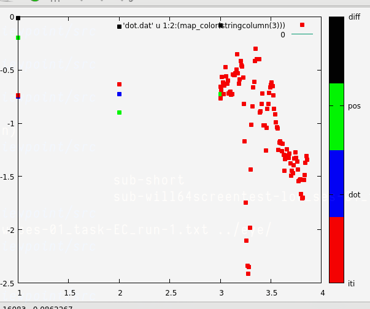

Using Avotec's camera with Arrington's ViewPoint software.

## Real time monitor
Unimplemented: using 
[gnuplot](http://tmacchant33.starfree.jp/gnuplot_files/gp550-20220907-win64-mingw.zip) + [perl](https://strawberryperl.com/releases.html) to watch realtime x position with per trial event median fixation.

See [dotplot.pl](src/dotplot.pl) and [dot.gnuplot](src/dot.gnuplot). Expects messages and fixations from [lncdtask.eyecal](https://github.com/LabNeuroCogDevel/lncdtask)

## Notes
  * [2022-09-07: 32 vs 64 channel coil](pdf/2022-09-07_32v64.pdf)

## Related
  * https://github.com/LabNeuroCogDevel/lncdtask (`eyecal.py`)
  * https://github.com/LabNeuroCogDevel/autoeyescore (`score_arrington.R`)

## References
  * https://technicalfmri.blogspot.com/2018/07/eye-tracking-with-arrington.html
  * http://www.bmap.ucla.edu/docs/ViewPoint-UserGuide-100.pdf
  * https://www.avotecinc.com/eye-monitoring-tracking-solution (`Real Eye 5701`)

